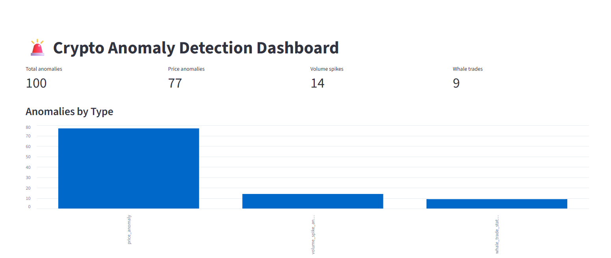
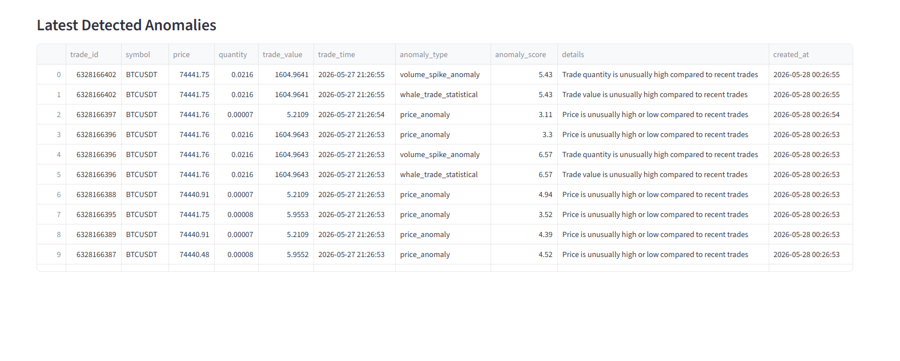
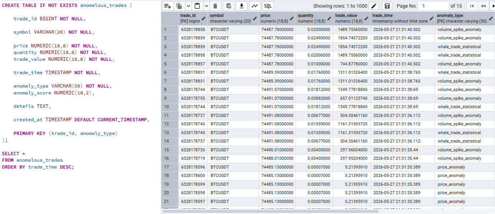

# 🚨 Crypto Anomaly Detection System

[](https://python.org)
[](https://postgresql.org)
[](https://streamlit.io)
[](https://sqlalchemy.org)
[](https://binance.com)
[](LICENSE)

> **[English version below](#english-version)**

---

## 🇦🇷 Versión en Español

Sistema de detección de anomalías en tiempo real para el mercado de criptomonedas. Consume datos de trading en vivo desde la API WebSocket de Binance, detecta comportamientos estadísticamente inusuales usando Z-score y almacena los resultados en PostgreSQL para su visualización en un dashboard interactivo de Streamlit.

---

### ✨ Características

- **Streaming en tiempo real** — Conexión persistente al WebSocket de Binance para trades de BTCUSDT
- **Tres detectores independientes** — Anomalías de precio, spikes de volumen y whale trades
- **Detección estadística con Z-score** — Umbrales adaptativos basados en la media y desviación estándar de trades recientes
- **Almacenamiento persistente en PostgreSQL** — Solo se guardan las anomalías detectadas, optimizando el almacenamiento
- **Dashboard en vivo con Streamlit** — KPIs, gráfico de barras por tipo y tabla de anomalías con auto-refresh
- **SQLAlchemy como ORM** — Acceso limpio y agnóstico a la base de datos
- **Configuración centralizada** — Todos los parámetros en un único módulo `config.py`

---

### 🏗️ Arquitectura

```
┌─────────────────────────────────────────────────────────────┐
│                    BINANCE WEBSOCKET API                     │
│              wss://stream.binance.com:9443                   │
│                   (BTCUSDT@trade stream)                     │
└────────────────────────┬────────────────────────────────────┘
                         │  Trade Events (JSON)
                         ▼
┌─────────────────────────────────────────────────────────────┐
│                 COLLECTOR  ·  app/collector.py               │
│   • Establece y mantiene la sesión WebSocket                 │
│   • Recibe eventos de trade en tiempo real                   │
│   • Coordina el flujo hacia el parser y el detector          │
└────────────┬───────────────────────────┬────────────────────┘
             │                           │
             ▼                           ▼
┌────────────────────────┐   ┌──────────────────────────────┐
│  PARSER · app/parser.py│   │  CONFIG · app/config.py      │
│  • Deserializa el JSON │   │  • Símbolos, umbrales Z-score │
│  • Extrae campos clave │   │  • Parámetros de la ventana   │
│    (precio, cantidad,  │   │    deslizante y conexión DB   │
│     timestamp, etc.)   │   └──────────────────────────────┘
└────────────┬───────────┘
             │  Trade objects
             ▼
┌─────────────────────────────────────────────────────────────┐
│           ANOMALY DETECTION ENGINE · app/detector.py        │
│                                                              │
│  ┌─────────────────┐  ┌──────────────────┐  ┌───────────┐  │
│  │  Price Anomaly  │  │  Volume Spike    │  │  Whale    │  │
│  │  Detector       │  │  Detector        │  │  Trade    │  │
│  │  (Z-score)      │  │  (Z-score)       │  │  Detector │  │
│  └─────────────────┘  └──────────────────┘  └───────────┘  │
└────────────────────────┬────────────────────────────────────┘
                         │  Anomaly records
                         ▼
┌─────────────────────────────────────────────────────────────┐
│            ANOMALIES WRITER · app/anomalies.py              │
│   • Formatea y prepara los registros de anomalías           │
│   • Delega la persistencia a database.py                     │
└────────────────────────┬────────────────────────────────────┘
                         │
                         ▼
┌─────────────────────────────────────────────────────────────┐
│            DATABASE LAYER · app/database.py                  │
│   • Gestiona la sesión SQLAlchemy                            │
│   • Escribe en la tabla anomalous_trades                     │
│   • Expone queries para el dashboard                         │
└────────────────────────┬────────────────────────────────────┘
                         │  SQL queries via SQLAlchemy
                         ▼
┌─────────────────────────────────────────────────────────────┐
│                     POSTGRESQL                               │
│              anomalous_trades table                          │
│   • Clave primaria compuesta: (trade_id, anomaly_type)       │
└────────────────────────┬────────────────────────────────────┘
                         │
                         ▼
┌─────────────────────────────────────────────────────────────┐
│              STREAMLIT DASHBOARD · dashboard/app.py          │
│   • KPIs: total anomalías, por tipo                          │
│   • Gráfico de barras: distribución por tipo                 │
│   • Tabla de últimas anomalías detectadas                    │
│   • Auto-refresh configurable                                │
└─────────────────────────────────────────────────────────────┘
```

---

### 🔍 Detectores de Anomalías

#### 1. Price Anomaly Detector
Detecta precios estadísticamente inusuales comparados con los trades recientes.

- Calcula la media (`μ`) y desviación estándar (`σ`) del precio de los últimos N trades
- Computa el **Z-score**: `z = (precio_actual - μ) / σ`
- Si `|z| > umbral` (configurable en `config.py`), el trade se marca como `price_anomaly`
- **Caso de uso real:** Detecta flash crashes, manipulación de precios o errores de mercado

#### 2. Volume Spike Detector
Identifica trades con cantidades inusualmente grandes respecto al volumen histórico reciente.

- Aplica el mismo enfoque de Z-score sobre la columna `quantity`
- Un Z-score elevado en volumen indica actividad de compra/venta fuera de lo ordinario
- Tipo de anomalía: `volume_spike_anomaly`
- **Caso de uso real:** Señala acumulación masiva, liquidaciones forzadas o market making agresivo

#### 3. Whale Trade Detector
Detecta trades de alto valor absoluto usando dos enfoques complementarios:

- **Umbral fijo:** Si el valor del trade (`price × quantity`) supera un monto absoluto configurado
- **Umbral estadístico:** Z-score sobre `trade_value` respecto a los trades recientes
- Tipo de anomalía: `whale_trade_statistical`
- **Caso de uso real:** Identifica movimientos de grandes capitales que pueden preceder cambios de tendencia

#### ¿Cómo funciona el Z-score?
```
z = (valor_observado - media_histórica) / desviación_estándar

z > 3.0  →  Anomalía severa (muy por encima de lo normal)
z < -3.0 →  Anomalía severa (muy por debajo de lo normal)
-3 < z < 3 → Comportamiento normal (cubre el 99.7% de los casos)
```

La ventana deslizante de N trades recientes permite que los umbrales se adapten automáticamente a las condiciones de mercado del momento, en lugar de usar valores históricos rígidos.

---

### 🛠️ Stack Tecnológico

| Capa | Tecnología | Propósito |
|---|---|---|
| Datos en tiempo real | `websockets` + Binance API | Stream de trades en vivo |
| Procesamiento | `pandas`, `numpy` | Cálculo de estadísticas y Z-scores |
| Detección | Python + estadística | Motor de anomalías modular |
| Base de datos | `PostgreSQL 15+` | Almacenamiento persistente |
| ORM | `SQLAlchemy` | Acceso a base de datos |
| Dashboard | `Streamlit` | Visualización interactiva |
| Infraestructura | `Docker Compose` | PostgreSQL en contenedor |

---

### 📁 Estructura del Proyecto

```
crypto-anomaly-detection/
│
├── app/
│   ├── main.py           # Punto de entrada: inicializa y orquesta el pipeline
│   ├── collector.py      # Conexión WebSocket a Binance y loop de recolección
│   ├── parser.py         # Parseo de eventos de trade del stream WebSocket
│   ├── detector.py       # Motor de detección: Z-score para precio, volumen y valor
│   ├── anomalies.py      # Construcción y formateo de registros de anomalías
│   ├── database.py       # Sesión SQLAlchemy, escritura y queries a PostgreSQL
│   └── config.py         # Configuración centralizada: símbolos, umbrales, DB URL
│
├── dashboard/
│   └── app.py            # Dashboard de Streamlit: KPIs, gráficos y tabla en vivo
│
├── sql/
│   └── init.sql          # Script DDL: creación de la tabla anomalous_trades
│
├── docker-compose.yml    # Levanta PostgreSQL en contenedor
├── requirements.txt      # Dependencias Python del proyecto
└── .gitignore
```

---

### ⚙️ Instalación y Ejecución

#### Prerrequisitos
- Python 3.10+
- Docker y Docker Compose

#### Paso a paso

```bash
# 1. Clonar el repositorio
git clone https://github.com/lucaserben/crypto-anomaly-detection.git
cd crypto-anomaly-detection

# 2. Levantar PostgreSQL con Docker
docker-compose up -d

# 3. Crear y activar entorno virtual
python -m venv venv
source venv/bin/activate        # Linux/macOS
# venv\Scripts\activate         # Windows

# 4. Instalar dependencias
pip install -r requirements.txt

# 5. Ejecutar el colector (terminal 1)
python app/main.py

# 6. Ejecutar el dashboard (terminal 2)
streamlit run dashboard/app.py
```

> **Nota:** `docker-compose.yml` levanta únicamente el servicio de PostgreSQL. El colector y el dashboard se ejecutan directamente con Python.

---

### 📊 Dashboard

El dashboard de Streamlit provee visibilidad en tiempo real sobre todas las anomalías detectadas.

**Vista general con KPIs y gráfico por tipo:**


*KPIs en tiempo real: 100 anomalías totales detectadas — 77 de precio, 14 spikes de volumen, 9 whale trades. El gráfico de barras permite identificar visualmente la distribución por tipo.*

**Tabla de últimas anomalías detectadas:**


*Tabla en vivo con los campos más relevantes: trade_id, symbol, precio, cantidad, valor, timestamp, tipo de anomalía, score y descripción detallada.*

**Almacenamiento en PostgreSQL:**


*Vista de la tabla `anomalous_trades`. Se observan registros de múltiples tipos de anomalía para el mismo `trade_id` gracias a la clave primaria compuesta `(trade_id, anomaly_type)`.*

---

### 🗄️ Base de Datos

#### Tabla `anomalous_trades`

```sql
CREATE TABLE IF NOT EXISTS anomalous_trades (
    trade_id       BIGINT NOT NULL,
    symbol         VARCHAR(20) NOT NULL,
    price          NUMERIC(18,8) NOT NULL,
    quantity       NUMERIC(18,8) NOT NULL,
    trade_value    NUMERIC(18,8) NOT NULL,
    trade_time     TIMESTAMP NOT NULL,
    anomaly_type   VARCHAR(50) NOT NULL,
    anomaly_score  NUMERIC(10,2),
    details        TEXT,
    created_at     TIMESTAMP DEFAULT CURRENT_TIMESTAMP,
    PRIMARY KEY (trade_id, anomaly_type)
);
```

**¿Por qué clave primaria compuesta `(trade_id, anomaly_type)`?**
Un mismo trade puede generar múltiples anomalías simultáneamente. El trade `6328166396` visible en el dashboard fue marcado a la vez como `price_anomaly`, `volume_spike_anomaly` y `whale_trade_statistical`. La clave compuesta permite almacenar cada una de forma independiente sin duplicados ni pérdida de información.

**¿Por qué almacenar solo anomalías y no todos los trades?**
Binance genera miles de trades por minuto. Guardarlos todos requeriría infraestructura significativa sin agregar valor analítico. Este enfoque optimiza el almacenamiento, reduce costos y simplifica las queries del dashboard.

---

### 🚀 Mejoras Futuras

- [ ] **Docker Compose completo** — Containerizar el colector y el dashboard junto a PostgreSQL para levantamiento en un solo comando
- [ ] **Apache Kafka** — Introducir una capa de mensajería para desacoplar la recolección de la detección y soportar múltiples consumidores en paralelo
- [ ] **Alertas en Telegram / Discord** — Notificaciones push cuando se detecta una anomalía de alta severidad
- [ ] **Soporte multi-símbolo** — Extender el sistema a ETHUSDT, SOLUSDT y otros pares configurables desde `config.py`
- [ ] **Algoritmos adicionales** — Isolation Forest, DBSCAN o modelos de series temporales (ARIMA, LSTM)
- [ ] **Tests automatizados** — Unit tests para cada detector con `pytest`

---

### 💼 Portfolio / Resume

Este proyecto demuestra competencias en las siguientes áreas:

| Habilidad | Aplicación en este proyecto |
|---|---|
| **Python** | Pipeline asincrónico completo, ORM, procesamiento de datos |
| **Streaming Data Processing** | Ingesta en tiempo real desde WebSocket con ventana deslizante |
| **Statistical Analysis** | Z-score adaptativo; análisis multi-métrica sobre datos de mercado |
| **PostgreSQL** | Diseño de esquema con clave primaria compuesta; estrategia de almacenamiento optimizada |
| **SQLAlchemy** | Capa de persistencia con ORM; separación limpia de responsabilidades |
| **Streamlit** | Dashboard interactivo con KPIs, gráficos y tablas en vivo |
| **Software Architecture** | Diseño modular: collector → parser → detector → anomalies → database → dashboard |
| **Docker** | Containerización de PostgreSQL con `docker-compose.yml` |

---

### 📄 Licencia

Distribuido bajo la licencia MIT.

---

---

<a name="english-version"></a>

## 🇬🇧 English Version

Real-time cryptocurrency anomaly detection system. Consumes live trade data from the Binance WebSocket API, detects statistically unusual behavior using Z-score based methods, and stores results in PostgreSQL for visualization in an interactive Streamlit dashboard.

---

### ✨ Features

- **Real-time streaming** — Persistent WebSocket connection to Binance for BTCUSDT trades
- **Three independent detectors** — Price anomalies, volume spikes, and whale trades
- **Statistical detection with Z-score** — Adaptive thresholds based on mean and standard deviation of recent trades
- **Persistent PostgreSQL storage** — Only detected anomalies are stored, optimizing disk usage
- **Live Streamlit dashboard** — KPIs, bar chart by type, and anomaly table with auto-refresh
- **SQLAlchemy ORM** — Clean, database-agnostic data access layer
- **Centralized configuration** — All parameters managed in a single `config.py` module

---

### 🏗️ Architecture

```
┌─────────────────────────────────────────────────────────────┐
│                    BINANCE WEBSOCKET API                     │
│              wss://stream.binance.com:9443                   │
│                   (BTCUSDT@trade stream)                     │
└────────────────────────┬────────────────────────────────────┘
                         │  Trade Events (JSON)
                         ▼
┌─────────────────────────────────────────────────────────────┐
│                COLLECTOR  ·  app/collector.py                │
│   • Establishes and maintains the WebSocket session          │
│   • Receives trade events in real time                       │
│   • Coordinates flow to parser and detector                  │
└────────────┬───────────────────────────┬────────────────────┘
             │                           │
             ▼                           ▼
┌────────────────────────┐   ┌──────────────────────────────┐
│  PARSER · app/parser.py│   │  CONFIG · app/config.py      │
│  • Deserializes JSON   │   │  • Symbols, Z-score thresholds│
│  • Extracts key fields │   │  • Sliding window size, DB URL│
│    (price, qty, time)  │   └──────────────────────────────┘
└────────────┬───────────┘
             │  Trade objects
             ▼
┌─────────────────────────────────────────────────────────────┐
│           ANOMALY DETECTION ENGINE · app/detector.py        │
│                                                              │
│  ┌─────────────────┐  ┌──────────────────┐  ┌───────────┐  │
│  │  Price Anomaly  │  │  Volume Spike    │  │  Whale    │  │
│  │  Detector       │  │  Detector        │  │  Trade    │  │
│  │  (Z-score)      │  │  (Z-score)       │  │  Detector │  │
│  └─────────────────┘  └──────────────────┘  └───────────┘  │
└────────────────────────┬────────────────────────────────────┘
                         │  Anomaly records
                         ▼
┌─────────────────────────────────────────────────────────────┐
│            ANOMALIES WRITER · app/anomalies.py              │
│   • Formats and prepares anomaly records                     │
│   • Delegates persistence to database.py                     │
└────────────────────────┬────────────────────────────────────┘
                         │
                         ▼
┌─────────────────────────────────────────────────────────────┐
│             DATABASE LAYER · app/database.py                 │
│   • Manages SQLAlchemy session                               │
│   • Writes to anomalous_trades table                         │
│   • Exposes queries for the dashboard                        │
└────────────────────────┬────────────────────────────────────┘
                         │  SQL queries via SQLAlchemy
                         ▼
┌─────────────────────────────────────────────────────────────┐
│                     POSTGRESQL                               │
│              anomalous_trades table                          │
│   • Composite primary key: (trade_id, anomaly_type)          │
└────────────────────────┬────────────────────────────────────┘
                         │
                         ▼
┌─────────────────────────────────────────────────────────────┐
│              STREAMLIT DASHBOARD · dashboard/app.py          │
│   • KPIs: total anomalies, by type                           │
│   • Bar chart: distribution by type                          │
│   • Latest detected anomalies table                          │
│   • Configurable auto-refresh                                │
└─────────────────────────────────────────────────────────────┘
```

---

### 🔍 Anomaly Detectors

#### 1. Price Anomaly Detector
Detects statistically unusual prices compared to recent trades.

- Computes the mean (`μ`) and standard deviation (`σ`) of price across the last N trades
- Calculates the **Z-score**: `z = (current_price - μ) / σ`
- If `|z| > threshold` (configurable in `config.py`), the trade is flagged as `price_anomaly`
- **Real-world use case:** Detects flash crashes, price manipulation, or market errors

#### 2. Volume Spike Detector
Identifies trades with unusually large quantities relative to recent volume history.

- Applies the same Z-score approach to the `quantity` column
- A high volume Z-score indicates abnormal buy/sell activity
- Anomaly type: `volume_spike_anomaly`
- **Real-world use case:** Signals mass accumulation, forced liquidations, or aggressive market making

#### 3. Whale Trade Detector
Detects high absolute-value trades using two complementary approaches:

- **Fixed threshold:** If trade value (`price × quantity`) exceeds a configured absolute amount
- **Statistical threshold:** Z-score on `trade_value` relative to recent trades
- Anomaly type: `whale_trade_statistical`
- **Real-world use case:** Identifies large capital movements that may precede trend changes

#### How Z-score Works
```
z = (observed_value - historical_mean) / standard_deviation

z > 3.0  →  Severe anomaly (far above normal)
z < -3.0 →  Severe anomaly (far below normal)
-3 < z < 3 → Normal behavior (covers 99.7% of cases)
```

A sliding window of the last N trades allows thresholds to adapt automatically to current market conditions rather than using rigid historical values.

---

### 🛠️ Technology Stack

| Layer | Technology | Purpose |
|---|---|---|
| Real-time data | `websockets` + Binance API | Live trade stream |
| Processing | `pandas`, `numpy` | Statistics and Z-score calculation |
| Detection | Python + statistics | Modular anomaly detection engine |
| Database | `PostgreSQL 15+` | Persistent storage |
| ORM | `SQLAlchemy` | Database access layer |
| Dashboard | `Streamlit` | Interactive visualization |
| Infrastructure | `Docker Compose` | PostgreSQL containerization |

---

### 📁 Project Structure

```
crypto-anomaly-detection/
│
├── app/
│   ├── main.py           # Entry point: initializes and orchestrates the pipeline
│   ├── collector.py      # Binance WebSocket connection and collection loop
│   ├── parser.py         # Trade event parsing from the WebSocket stream
│   ├── detector.py       # Detection engine: Z-score for price, volume, and value
│   ├── anomalies.py      # Anomaly record construction and formatting
│   ├── database.py       # SQLAlchemy session, writes and queries to PostgreSQL
│   └── config.py         # Centralized config: symbols, thresholds, DB URL
│
├── dashboard/
│   └── app.py            # Streamlit dashboard: KPIs, charts, and live table
│
├── sql/
│   └── init.sql          # DDL script: anomalous_trades table creation
│
├── docker-compose.yml    # Runs PostgreSQL in a container
├── requirements.txt      # Python project dependencies
└── .gitignore
```

---

### ⚙️ Installation & Setup

#### Prerequisites
- Python 3.10+
- Docker and Docker Compose

#### Step by step

```bash
# 1. Clone the repository
git clone https://github.com/lucaserben/crypto-anomaly-detection.git
cd crypto-anomaly-detection

# 2. Start PostgreSQL with Docker
docker-compose up -d

# 3. Create and activate virtual environment
python -m venv venv
source venv/bin/activate        # Linux/macOS
# venv\Scripts\activate         # Windows

# 4. Install dependencies
pip install -r requirements.txt

# 5. Run the collector (terminal 1)
python app/main.py

# 6. Run the dashboard (terminal 2)
streamlit run dashboard/app.py
```

> **Note:** `docker-compose.yml` runs only the PostgreSQL service. The collector and dashboard run directly with Python.

---

### 📊 Dashboard

The Streamlit dashboard provides real-time visibility into all detected anomalies.

**Overview with KPIs and chart by type:**


*Real-time KPIs: 100 total anomalies detected — 77 price anomalies, 14 volume spikes, 9 whale trades. The bar chart enables visual identification of anomaly distribution by type.*

**Latest detected anomalies table:**


*Live table showing the most relevant fields: trade_id, symbol, price, quantity, value, timestamp, anomaly type, score, and detailed description.*

**PostgreSQL storage:**


*View of the `anomalous_trades` table in PostgreSQL. Multiple anomaly types per trade_id are stored thanks to the composite primary key `(trade_id, anomaly_type)`.*

---

### 🗄️ Database

#### `anomalous_trades` Table

```sql
CREATE TABLE IF NOT EXISTS anomalous_trades (
    trade_id       BIGINT NOT NULL,
    symbol         VARCHAR(20) NOT NULL,
    price          NUMERIC(18,8) NOT NULL,
    quantity       NUMERIC(18,8) NOT NULL,
    trade_value    NUMERIC(18,8) NOT NULL,
    trade_time     TIMESTAMP NOT NULL,
    anomaly_type   VARCHAR(50) NOT NULL,
    anomaly_score  NUMERIC(10,2),
    details        TEXT,
    created_at     TIMESTAMP DEFAULT CURRENT_TIMESTAMP,
    PRIMARY KEY (trade_id, anomaly_type)
);
```

**Why a composite primary key `(trade_id, anomaly_type)`?**
A single trade can trigger multiple anomaly types simultaneously. Trade `6328166396` (visible in the dashboard) was flagged at the same time as `price_anomaly`, `volume_spike_anomaly`, and `whale_trade_statistical`. The composite key allows each to be stored independently without duplicates.

**Why store only anomalies instead of all trades?**
Binance generates thousands of trades per minute. Storing all of them would require significant infrastructure without adding analytical value. This approach optimizes storage, reduces costs, and simplifies dashboard queries.

---

### 🚀 Future Improvements

- [ ] **Full Docker Compose** — Containerize the collector and dashboard alongside PostgreSQL for single-command startup
- [ ] **Apache Kafka** — Introduce a messaging layer to decouple collection from detection and support multiple parallel consumers
- [ ] **Telegram / Discord alerts** — Push notifications when a high-severity anomaly is detected
- [ ] **Multi-symbol support** — Extend the system to ETHUSDT, SOLUSDT, and other pairs configurable via `config.py`
- [ ] **Additional algorithms** — Isolation Forest, DBSCAN, or time-series models (ARIMA, LSTM)
- [ ] **Automated tests** — Unit tests for each detector with `pytest`

---

### 💼 Portfolio / Resume

This project demonstrates proficiency in the following areas:

| Skill | Application in this project |
|---|---|
| **Python** | Full async pipeline, ORM usage, data processing |
| **Streaming Data Processing** | Real-time WebSocket ingestion with sliding window management |
| **Statistical Analysis** | Adaptive Z-score detection; multi-metric analysis on live market data |
| **PostgreSQL** | Schema design with composite primary keys; optimized storage strategy |
| **SQLAlchemy** | ORM-based persistence layer; clean separation of concerns |
| **Streamlit** | Interactive dashboard with KPIs, charts, and live data tables |
| **Software Architecture** | Modular pipeline: collector → parser → detector → anomalies → database → dashboard |
| **Docker** | PostgreSQL containerization with `docker-compose.yml` |

---

### 📄 License

Distributed under the MIT License.

---

*Built by [Lucas Erben](https://github.com/lucaserben)*
